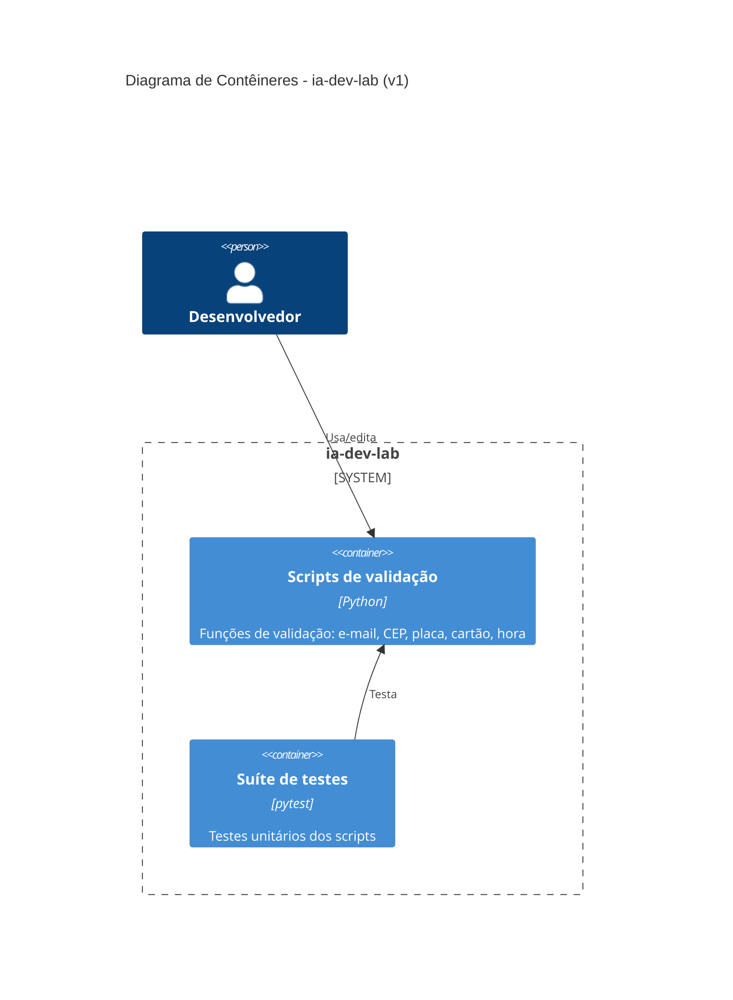

# Etapa 5 — Diagrama C4 (contêiner), versão 1

Gerado com prompt curto e genérico ("gere um diagrama C4 de contêiner deste
projeto Python"), sem apontar para `docs/etapa4-arquitetura.md` nem para o
que a atividade de fato investigou (hooks, tdd-guard, checkpoints).

