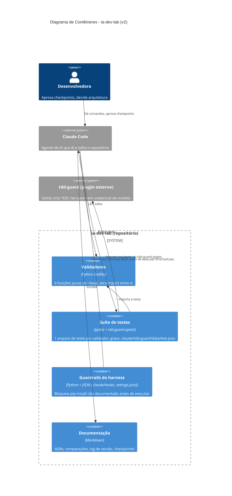

# Etapa 5 — Diagrama C4 (contêiner), versão 2

Gerado com prompt de mais contexto: apontando para `docs/etapa4-arquitetura.md`
(análise real de acoplamento) e `docs/etapa2-tdd.md`/`docs/etapa1-hook-evidencia.md`
(hooks e tdd-guard), pedindo explicitamente para representar os elementos
que a atividade "Harness e Arquitetura" de fato investigou — não só o
código de produção.

